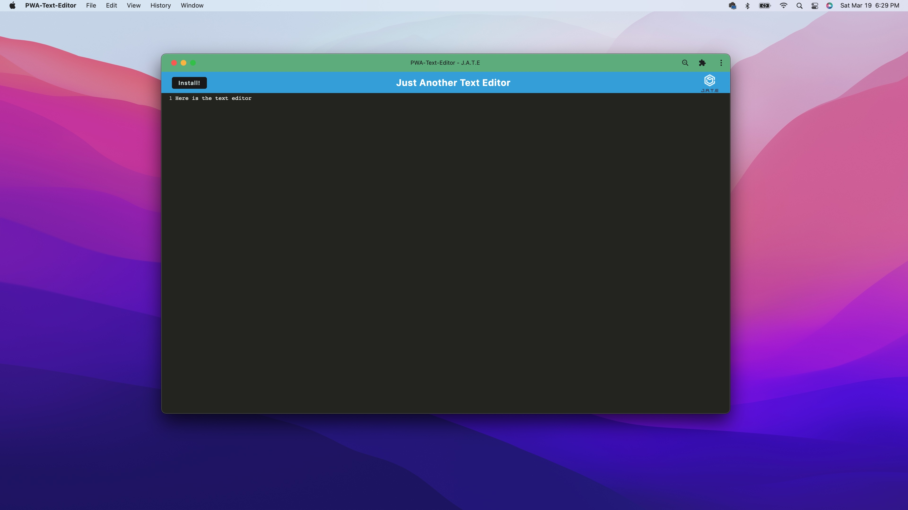

# PWA-Text-Editor

## Description:
This app is a single page (progressive web application) PWA that functions offline as well as online with an internet connection. The application uses IndexedDB as a database to store the information that is written with the app. 

## Table of Contents:

-- [Usage](#usage)

-- [Installation](#installation)

-- [License](#license)

-- [Contributors](#contributors)

-- [Github User Name](#Github-User-Name)

-- [Email](#email)

-- [Test](#test)

## Usage:

Here is a link to a [demo]()

## Installation:
Once you have the code on your computer you can open an integrated terminal and run the codes: npm i, npm install, npm run build, and npm run start:dev, these will start the server and will be listening on PORT:3000. Now when you open a Google Chrome browser on localhost:3000 you will see the application. 
Another way to look at this application will be with the deployed link with Heroku. 

## License:

 [License: MIT](https://opensource.org/licenses/MIT)
Permission is hereby granted, free of charge, to any person obtaining a copy of this software and associated documentation files (the "Software"), to deal in the Software without restriction, including without limitation the rights to use, copy, modify, merge, publish, distribute, sublicense, and/or sell copies of the Software, and to permit persons to whom the Software is furnished to do so, subject to the following conditions: The above copyright notice and this permission notice shall be included in all copies or substantial portions of the Software. THE SOFTWARE IS PROVIDED "AS IS", WITHOUT WARRANTY OF ANY KIND, EXPRESS OR IMPLIED, INCLUDING BUT NOT LIMITED TO THE WARRANTIES OF MERCHANTABILITY, FITNESS FOR A PARTICULAR PURPOSE AND NONINFRINGEMENT. IN NO EVENT SHALL THE AUTHORS OR COPYRIGHT HOLDERS BE LIABLE FOR ANY CLAIM, DAMAGES OR OTHER LIABILITY, WHETHER IN AN ACTION OF CONTRACT, TORT OR OTHERWISE, ARISING FROM, OUT OF OR IN CONNECTION WITH THE SOFTWARE OR THE USE OR OTHER DEALINGS IN THE SOFTWARE.

## Contributors:

Me.

## Github User Name:

Here is a link to my Github: https://github.com/GundamMosi10

## Email:

If you have any questions or would like to get in contact with me you can email me at this address: cargile10@gmail.com

## Test:

There are no tests associated with this project.
